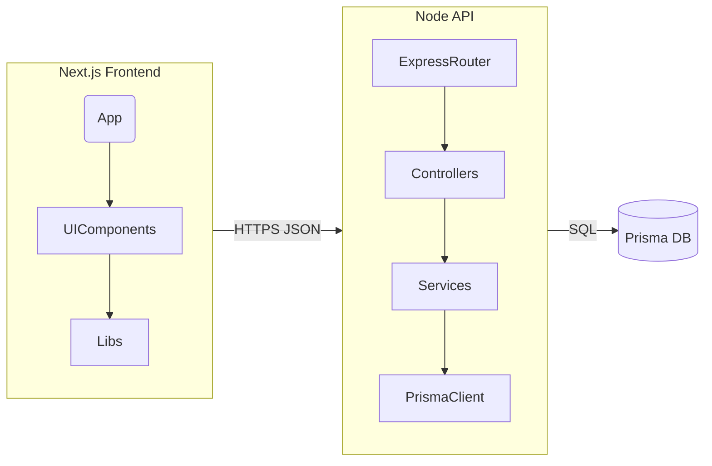

# System Design & Architecture

## Architecture Overview
**What is the high-level system structure?**

- Client: Next.js 14 app router with Tailwind for styling, Shadcn UI primitives, and shared utility hooks. Only base layout, sample page, and placeholder components remain.
- Server: Express (or Fastify-equivalent—follow current stack) with modular router/controller/service folders, but only skeleton handlers returning placeholder data.
- Database: Prisma schema trimmed to a single `Sample` model or empty placeholder so migrations stay valid.
- Supporting tooling: shared ESLint/Prettier configs, ai-devkit docs. Monitoring hooks can be re-added per project needs.
- Rationale: preserve proven stack and project layout so new projects can focus on feature work without redoing scaffolding.

## Data Models
**What data do we need to manage?**

- Core entities
  - `Sample` (or `HealthCheck`): minimal table to verify Prisma migrations and API wiring. Fields: `id`, `name`, `createdAt`.
  - Additional entities intentionally omitted; future projects will extend schema as needed.
- Schema strategy
  - Keep Prisma schema valid with placeholder models and comments pointing to extension points.
  - Provide seed script that inserts simple sample row or no-op.
- Data flow
  - Client sample page fetches `/api/health` (proxy to server) or server renders placeholder data.
  - Server controllers map request → service → Prisma (or stub) → response, showing the pattern without business rules.

## API Design
**How do components communicate?**

- Internal APIs
  - `GET /api/health` (client) → proxies to server or returns static status (Next.js route handler).
  - `GET /api/sample` (server) → returns placeholder list from DB/service stub.
  - `POST /api/sample` (optional) → demonstrates validation pattern without real business logic.
- Interfaces
  - Controllers accept typed DTOs; services encapsulate business rules (currently stubs); repositories/Prisma client handle persistence.
  - Shared TypeScript types live in `shared/` or dedicated folder for reuse between client/server.
- Auth
  - Provide hooks for auth middleware (e.g., NextAuth, JWT) but leave disabled or mocked.
  - Document where to plug in auth providers to keep boilerplate neutral.
- Request/response format
  - JSON payloads with `{ status, data, message }` pattern for consistency.

## Component Breakdown
**What are the major building blocks?**

- Frontend
  - `app/` root layout, `app/page.tsx` sample page, `components/ui/*` containing minimal buttons/forms, `lib/api.ts` for fetch helper.
- Config: Tailwind, ESLint, Prettier. Add analytics/monitoring only if required.
- Backend
  - `src/server.ts` (entry), `src/routes/index.ts`, `src/controllers/sample.controller.ts`, `src/services/sample.service.ts`, `src/repositories/sample.repo.ts`.
  - Error handling middleware, request validation (Zod or class-validator) with placeholder schemas.
- Database
  - `prisma/schema.prisma` trimmed to base datasource/generator + sample model.
  - `prisma/migrations/` cleaned or replaced with initial baseline.
- Third-party integrations
- Monitoring left to downstream projects.
  - File uploads, queue systems, external APIs removed; only leave extension hooks/comments.

## Design Decisions
**Why did we choose this approach?**

- Keep dual client/server directories to mirror real-world deployments and simplify future separation, even though feature set is minimal.
- Retain Prisma + relational DB abstractions so later features can expand schema without bootstrap work.
- Provide example controller/service layers instead of collapsing straight to Prisma to encourage clean architecture patterns.
- Trade-offs
  - Maintaining boilerplate for both client and server increases surface area, but it mirrors typical full-stack apps and avoids rework later.
  - Removing advanced modules means losing reference implementations; mitigated by documenting extension points and leaving TODO comments.
- Alternatives considered
  - Deleting backend entirely and using client-only stack: rejected to keep flexibility.
  - Keeping all historical modules but marking as optional: rejected due to clutter/confusion.
- Patterns applied
  - Clear separation of concerns (UI, API, data).
  - Convention over configuration for file structure.
  - Documentation-driven development via ai-devkit phases.

## Non-Functional Requirements
**How should the system perform?**

- Performance
  - Boilerplate should render sample page in <1s locally and respond to health endpoints within ~100ms to confirm wiring.
- Scalability
  - Architecture supports horizontal scaling later (stateless API, Prisma-managed DB). No immediate scaling work required.
- Security
  - Minimal security layers included (Helmet, rate limiting placeholders). Auth hooks documented; secrets managed via `.env.example`.
- Reliability
  - Dev server and API should start without runtime errors; graceful error handling/logging remains.
- Maintainability
  - Code comments/TODOs explain where to plug in new modules.
  - Linting/formatting enforced to keep style consistent across future projects.

