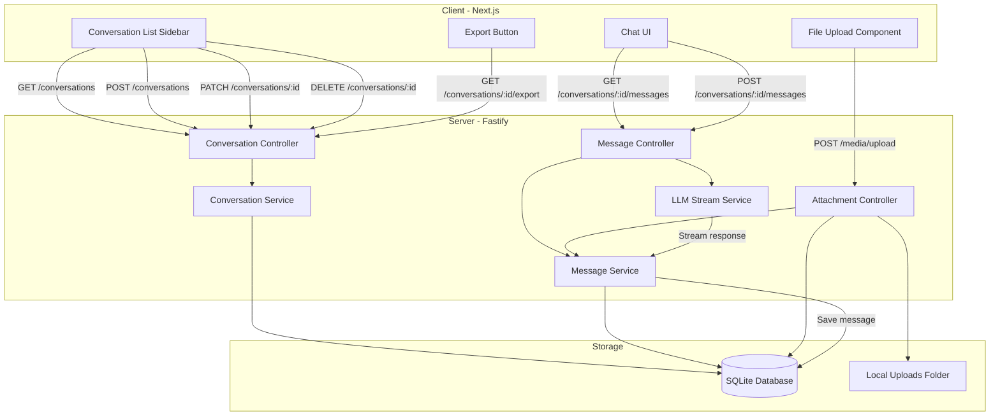

# System Design & Architecture

## Architecture Overview
**What is the high-level system structure?**



- **Client**: Next.js App Router with new routes for conversation management, reusing existing LLM UI components.
- **Server**: Fastify backend with new controllers/services for conversations, messages, and attachments.
- **Database**: SQLite (Prisma) with 3 new models: `Conversation`, `Message`, `MessageAttachment`.
- **File Storage**: Local uploads folder managed via `UPLOAD_FOLDER` env var.
- **Integration**: Extends existing `/llm/stream` to accept `conversationId` and persist messages post-streaming.

## Data Models
**What data do we need to manage?**

### Prisma Schema Changes

```prisma
model Account {
  id            Int             @id @default(autoincrement())
  name          String
  email         String          @unique
  password      String
  avatar        String?
  role          String          @default("user")
  createdAt     DateTime        @default(now())
  updatedAt     DateTime        @updatedAt
  deletedAt     DateTime?
  refreshToken  RefreshToken[]
  conversations Conversation[]  // NEW: one-to-many relation
}

model Conversation {
  id        String    @id @default(cuid())  // CUID for URL-safe IDs
  accountId Int
  title     String?                         // Auto-generated or user-edited
  model     String    @default("atlas-2.1") // LLM model used
  createdAt DateTime  @default(now())
  updatedAt DateTime  @updatedAt
  deletedAt DateTime?                       // Soft delete

  account  Account   @relation(fields: [accountId], references: [id], onDelete: Cascade)
  messages Message[]

  @@index([accountId])
  @@index([accountId, updatedAt(sort: Desc)]) // For "recent conversations" query
}

model Message {
  id             String              @id @default(cuid())
  conversationId String
  role           String              // "user" | "assistant" | "system"
  content        String              // Main text content (markdown-ready)
  reasoning      String?             // LLM thinking/reasoning (optional)
  metadata       String?             // JSON: { tokens, duration, model }
  createdAt      DateTime            @default(now())

  conversation Conversation        @relation(fields: [conversationId], references: [id], onDelete: Cascade)
  attachments  MessageAttachment[]

  @@index([conversationId])
  @@index([conversationId, createdAt]) // For chronological message order
}

model MessageAttachment {
  id        String   @id @default(cuid())
  messageId String
  fileUrl   String   // Relative path: /uploads/abc123.png
  fileName  String   // Original filename: document.pdf
  fileType  String   // MIME type: image/png, application/pdf
  fileSize  Int      // Size in bytes
  createdAt DateTime @default(now())

  message Message @relation(fields: [messageId], references: [id], onDelete: Cascade)

  @@index([messageId])
}
```

### Data Flow

1. **Create Conversation**: User clicks "New Chat" → POST `/conversations` → Creates `Conversation` with auto-generated title (or null).
2. **Send Message**: User types prompt + uploads file → POST `/conversations/:id/messages` → Creates `Message` (role: user) + `MessageAttachment` → Streams LLM response → Creates `Message` (role: assistant).
3. **Load Conversation**: User clicks conversation from list → GET `/conversations/:id/messages` → Returns all messages with attachments ordered by `createdAt`.
4. **Update Title**: User edits title → PATCH `/conversations/:id` → Updates `Conversation.title`.
5. **Delete Conversation**: User deletes chat → DELETE `/conversations/:id` → Sets `deletedAt` (soft delete).
6. **Export**: User clicks export → GET `/conversations/:id/export?format=json|md` → Returns formatted file.

## API Design
**How do components communicate?**

### REST Endpoints

#### Conversations
- `GET /api/conversations` - List user's conversations (paginated, sorted by updatedAt desc)
  - Query params: `?limit=20&offset=0&search=keyword`
  - Response 200: `{ conversations: [...], total: number }`
  - Response 401: Unauthorized (no auth token)
- `GET /api/conversations/:id` - Get single conversation details (without messages)
  - Response 200: `{ id, title, model, createdAt, updatedAt, messageCount }`
  - Response 401: Unauthorized
  - Response 403: Forbidden (user doesn't own conversation)
  - Response 404: Not Found (conversation doesn't exist)
- `POST /api/conversations` - Create new conversation
  - Body: `{ title?: string, model?: string }`
  - Response 201: `{ id, title, model, ... }`
  - Response 400: Bad Request (validation error)
  - Response 401: Unauthorized
- `PATCH /api/conversations/:id` - Update conversation (title only for MVP)
  - Body: `{ title: string }`
  - Response 200: `{ id, title, ... }`
  - Response 400: Bad Request (validation error)
  - Response 401: Unauthorized
  - Response 403: Forbidden
  - Response 404: Not Found
- `DELETE /api/conversations/:id` - Soft delete conversation
  - Response 204: No Content (success)
  - Response 401: Unauthorized
  - Response 403: Forbidden
  - Response 404: Not Found
- `GET /api/conversations/:id/export` - Export conversation
  - Query params: `?format=json|markdown`
  - Response 200: File download
    - JSON: `Content-Type: application/json`, `Content-Disposition: attachment; filename="conversation-{id}.json"`
    - Markdown: `Content-Type: text/markdown`, `Content-Disposition: attachment; filename="conversation-{id}.md"`
  - Response 400: Bad Request (invalid format)
  - Response 401: Unauthorized
  - Response 403: Forbidden
  - Response 404: Not Found

#### Messages
- `GET /api/conversations/:id/messages` - Get all messages in a conversation
  - Query params: `?limit=50&offset=0`
  - Response 200: `{ messages: [...], total: number }`
  - Response 401: Unauthorized
  - Response 403: Forbidden (user doesn't own conversation)
  - Response 404: Not Found (conversation doesn't exist)
- `POST /api/conversations/:id/messages` - Send new message (user prompt)
  - Body: `{ content: string, attachments?: string[] }` (attachments = file IDs from upload)
  - Response 200: Upgrades to SSE stream (text/event-stream) for assistant reply
  - Response 400: Bad Request (validation error, e.g., content too short)
  - Response 401: Unauthorized
  - Response 403: Forbidden
  - Response 404: Not Found
  - Side effect: Creates user message, streams assistant message, saves both

#### Attachments (use existing media controller)
- `POST /api/media/upload` - Upload file for message attachment
  - Body: FormData with file
  - Response 200: `{ fileId: string, fileName: string, fileUrl: string, fileSize: number, fileType: string }`
  - Response 400: Bad Request (file too large >10MB, unsupported file type)
  - Response 401: Unauthorized
- Files stored in `UPLOAD_FOLDER` (managed by existing `media.controller.ts`)
- After upload, file IDs are passed to `POST /conversations/:id/messages` to link attachments

### Error Response Format
**Standard error structure for all endpoints:**

```json
{
  "error": "Error message for display",
  "code": "ERROR_CODE",
  "details": {} // Optional, validation errors or additional context
}
```

**Error Codes:**
- `UNAUTHORIZED` - 401: Missing or invalid auth token
- `FORBIDDEN` - 403: User doesn't own the resource
- `NOT_FOUND` - 404: Resource doesn't exist or is soft-deleted
- `VALIDATION_ERROR` - 400: Request body/params failed validation
- `FILE_TOO_LARGE` - 400: File size exceeds 10MB
- `UNSUPPORTED_FILE_TYPE` - 400: File MIME type not allowed
- `INTERNAL_ERROR` - 500: Unexpected server error

### Pagination Strategy
**Backend API:**
- Use `limit/offset` query parameters for pagination
- Default: `limit=20`, `offset=0`
- Response includes `total` count for calculating page numbers
- Example: `GET /conversations?limit=20&offset=40` returns items 41-60

**Frontend UI:**
- Implement infinite scroll for conversation sidebar (loads next page on scroll)
- Or traditional pagination with "Load More" button
- React Query handles caching and deduplication automatically

### Auth
- All endpoints require authentication (JWT/session cookie).
- Authorization: Users can only access their own conversations (enforce `accountId` filtering).

### Streaming Integration
- Extend `/api/llm/stream` to accept `conversationId` in request body.
- After streaming completes, save assistant message to database with metadata (tokens, duration).

## Component Breakdown
**What are the major building blocks?**

### Backend (Server)

#### Controllers
- `conversation.controller.ts`
  - `listConversations()` - GET /conversations
  - `getConversation()` - GET /conversations/:id
  - `createConversation()` - POST /conversations
  - `updateConversation()` - PATCH /conversations/:id
  - `deleteConversation()` - DELETE /conversations/:id
  - `exportConversation()` - GET /conversations/:id/export

- `message.controller.ts`
  - `getMessages()` - GET /conversations/:id/messages
  - `sendMessage()` - POST /conversations/:id/messages (initiates stream)

- `media.controller.ts` (existing, reused for attachments)
  - `uploadFile()` - POST /media/upload
  - Validates file type, size, sanitizes filename
  - Returns file metadata for linking to messages

#### Services
- `conversation.service.ts`
  - `findByAccountId(accountId, filters)` - Query conversations with pagination/search
  - `create(accountId, data)` - Create conversation with auto-title generation
  - `update(id, data)` - Update conversation title
  - `softDelete(id)` - Set deletedAt timestamp
  - `exportToJSON(id)` / `exportToMarkdown(id)` - Generate export files

- `message.service.ts`
  - `findByConversationId(conversationId, filters)` - Query messages with attachments
  - `create(conversationId, role, content, reasoning?, metadata?)` - Save message
  - `createWithAttachments(conversationId, content, fileIds)` - Save user message + link attachments

#### Repositories
- `conversation.repository.ts`
  - Prisma queries for CRUD operations on `Conversation` model
  - Includes message counts, pagination, soft delete filtering

- `message.repository.ts`
  - Prisma queries for `Message` and `MessageAttachment` models
  - Joins to fetch attachments with messages

#### Routes
- `conversation.route.ts` - Register all conversation endpoints
- `message.route.ts` - Register message endpoints
- Both use existing `authHook` to protect routes

### Frontend (Client)

#### Pages
- `app/llm/page.tsx` - Main chat interface (existing, extend to support conversationId)
- `app/llm/conversations/page.tsx` - Conversation list page (new)
- `app/llm/conversations/[id]/page.tsx` - Load specific conversation (new)

#### Components
- `components/llm/conversation-sidebar.tsx` - Sidebar with conversation list, search, new chat button
- `components/llm/conversation-item.tsx` - Single conversation card (title, preview, timestamp)
- `components/llm/message-attachment.tsx` - Display attachment (thumbnail or file icon)
- `components/llm/file-upload-button.tsx` - File picker with validation
- `components/llm/export-menu.tsx` - Dropdown for export options (JSON/MD)

#### Hooks
- `queries/useConversations.tsx` - React Query hooks for conversation CRUD
  - `useConversationList()` - GET /conversations with pagination
  - `useConversation(id)` - GET /conversations/:id
  - `useCreateConversation()` - POST /conversations
  - `useUpdateConversation()` - PATCH /conversations/:id
  - `useDeleteConversation()` - DELETE /conversations/:id

- `queries/useMessages.tsx` - React Query hooks for messages
  - `useMessages(conversationId)` - GET /conversations/:id/messages
  - `useSendMessage()` - POST /conversations/:id/messages

- `queries/useAttachments.tsx` - File upload handling
  - `useUploadFile()` - POST /media/upload

#### API Requests
- `apiRequests/conversation.ts` - HTTP client functions for conversation endpoints
- `apiRequests/message.ts` - HTTP client functions for message endpoints

#### Schema Validations
- `schemaValidations/conversation.schema.ts` - Zod schemas for conversation create/update
- `schemaValidations/message.schema.ts` - Zod schemas for message create (with attachments)

### Database Migrations
- `prisma/migrations/xxx_add_conversation_models.sql` - Add Conversation, Message, MessageAttachment tables

## Design Decisions
**Why did we choose this approach?**

- **CUID for IDs**: URL-safe, globally unique, better than autoincrement for distributed systems or public-facing IDs.
- **Soft delete**: Users expect to recover deleted conversations (undo/trash pattern); hard delete can be admin-only.
- **Separate Attachment model**: Allows multiple files per message, easier to query/cascade delete than JSON arrays.
- **Metadata as JSON string**: Flexible for storing token counts, model params, etc. without rigid schema changes.
- **Auto-title from first message**: Reduces friction (users don't have to name every chat), but allows manual override.
- **Reuse existing media upload**: Leverage `/media/upload` route to avoid duplicating file validation logic.
- **Pagination on conversations**: Prevents performance issues for power users with hundreds of chats.
- **Cascade deletes**: When conversation is deleted, all messages and attachments are cleaned up automatically (Prisma handles this).
- **Local file storage**: Simpler for MVP; cloud storage (S3) can be swapped in later without changing API contract.

### Trade-offs
- **SQLite vs PostgreSQL**: SQLite is fine for MVP (<1000 conversations/user), but may need migration for multi-user scale.
- **In-memory vs persistent streaming**: Keeping streaming ephemeral (current design) is simpler; adding persistence requires careful transaction handling.
- **Export formats**: JSON (machine-readable) and Markdown (human-readable) cover most use cases; PDF/HTML export is future enhancement.

### Patterns
- Repository pattern for database abstraction (easier to test, swap ORMs).
- Service layer for business logic (title generation, export formatting).
- React Query for client-side caching and optimistic updates.
- Zod schemas shared between client/server for type safety.

## Non-Functional Requirements
**How should the system perform?**

- **Performance**
  - Loading conversation list (20 items) should take <200ms.
  - Loading a conversation with 50 messages should take <500ms.
  - File upload (5MB) should complete in <2s on local network.
  - Pagination/infinite scroll should feel instant (<100ms to fetch next page).

- **Scalability**
  - Design supports pagination for users with 1000+ conversations.
  - Indexes on `(accountId, updatedAt)` and `(conversationId, createdAt)` prevent slow queries.
  - File storage can be migrated to cloud (S3) without API changes.

- **Security**
  - Validate file types (MIME + extension check) to prevent executable uploads.
  - Validate file size (reject >10MB) to prevent disk exhaustion.
  - Sanitize file names (remove path traversal chars) before storing.
  - Enforce user ownership checks (users can only access their conversations).
  - Never expose other users' conversation IDs or file paths.

- **Reliability**
  - Soft delete allows recovery from accidental deletions.
  - Cascade deletes ensure no orphaned messages/attachments.
  - File cleanup job (future) to delete orphaned files if attachments are deleted.
  - Transactional saves: If LLM streaming fails mid-response, still save partial message (or rollback user message).

- **Usability**
  - Auto-generated titles should be meaningful (first 50 chars of prompt, trimmed).
  - Conversation list sorted by most recent activity (updatedAt), not creation time.
  - Search should filter by title AND message content (full-text search is future enhancement).
  - Export should preserve markdown formatting and attachment references.

## Database Indexes
**Optimize common queries:**

- `Conversation`:
  - `@@index([accountId])` - Filter by user
  - `@@index([accountId, updatedAt(sort: Desc)])` - Recent conversations query
- `Message`:
  - `@@index([conversationId])` - Fetch all messages in a conversation
  - `@@index([conversationId, createdAt])` - Chronological order
- `MessageAttachment`:
  - `@@index([messageId])` - Fetch attachments for a message

## File Storage Strategy
**Local uploads folder structure:**

```
uploads/
  conversations/
    {conversationId}/
      {messageId}/
        {fileId}.{ext}
```

- Organize by conversation and message to simplify cleanup.
- Use `fileId` (CUID) as filename to avoid collisions and sanitize user input.
- Store original filename in database (`MessageAttachment.fileName`) for display.

## Export Format Examples

### JSON Export
```json
{
  "id": "clx123abc",
  "title": "Discuss React performance optimization",
  "model": "atlas-2.1",
  "createdAt": "2025-11-18T10:00:00Z",
  "messages": [
    {
      "id": "clx456def",
      "role": "user",
      "content": "How can I optimize React re-renders?",
      "createdAt": "2025-11-18T10:00:00Z",
      "attachments": []
    },
    {
      "id": "clx789ghi",
      "role": "assistant",
      "content": "Here are some strategies...",
      "reasoning": "User is asking about performance...",
      "metadata": { "tokens": { "prompt": 20, "completion": 150 } },
      "createdAt": "2025-11-18T10:00:05Z",
      "attachments": []
    }
  ]
}
```

### Markdown Export
```markdown
# Discuss React performance optimization

**Model:** atlas-2.1  
**Created:** 2025-11-18 10:00 AM

---

## Message 1 (User)
*2025-11-18 10:00 AM*

How can I optimize React re-renders?

---

## Message 2 (Assistant)
*2025-11-18 10:00 AM*

Here are some strategies...

<details>
<summary>Reasoning</summary>
User is asking about performance...
</details>

---
```
