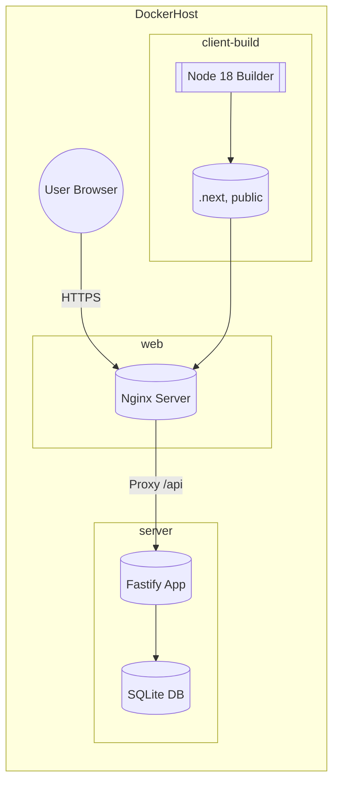

# System Design & Architecture

## Architecture Overview

**What is the high-level system structure?**

- Containerized architecture with three primary services orchestrated by Docker Compose: `client` (builds Next.js bundle), `web` (Nginx serving static assets and proxying API), and `server` (Fastify API with SQLite).
- Multi-stage Dockerfiles keep images lean: Node builder stages install dependencies and run `next build`/`pnpm build`, final runtime stages are Nginx (client) and Node (server) with only production dependencies.
- Technology choices:
  - **Nginx** for static hosting + reverse proxy (best practice for Next.js production output).
  - **Docker Compose** for orchestrating containers, sharing environment variables, mounting SQLite volume.
  - **SQLite** persists on a named volume to survive container restarts.
  - **Observability**: containers emit structured stdout logs and expose health/metrics endpoints so external monitoring stacks (Prometheus, ELK, CloudWatch, etc.) can scrape/collect data.

Key responsibilities:

- **client-build stage**: installs dependencies, builds Next.js, outputs optimized assets.
- **web (Nginx)**: serves `/` from Next.js build, proxies `/api/*` to Fastify service.
- **server (Fastify)**: exposes API, reads SQLite database stored on `sqlite_data` Docker volume.

## Data Models

**What data do we need to manage?**

- No application schema changes; we continue to use SQLite file `database/dev.db`.
- Docker Compose defines a named volume `sqlite_data` mounted into the Fastify container at `/app/database`.
- Nginx configuration includes upstream target for Fastify (e.g., `server` service at port 4000).
- Environment variables stored in `.env` or Compose override for:
  - Fastify: `PORT`, `NODE_ENV`, `DATABASE_URL=sqlite:///app/database/dev.db`.
  - Next.js build: `NEXT_PUBLIC_*` envs injected during `next build`.
- TLS termination: assume upstream reverse proxy (e.g., cloud LB) handles HTTPS termination. If TLS inside the container is required, document how to mount certs and update Nginx config accordingly.
- GitHub Actions injects production secrets via encrypted vars/secrets; runtimes rely on environment variables passed at container start rather than bundled `.env` files.

## API Design

**How do components communicate?**

- No external API changes—Fastify routes remain as-is.
- Internal communication:
  - Nginx proxies `/api` traffic to `server:4000`.
  - Browser interacts only with Nginx (`web` service) which serves static files and proxies API calls.
- Authentication/authorization unchanged (Fastify continues to enforce existing JWT tokens).
- Health endpoints can be optionally exposed (e.g., `/healthz`) for Compose healthchecks.

## Component Breakdown

**What are the major building blocks?**

- **Dockerfiles**
  - `client/Dockerfile`: multi-stage (deps cache, builder, Nginx runtime).
  - `server/Dockerfile`: multi-stage (deps cache, production runtime).
- **docker-compose.yml**
  - Services: `client-builder` (optional), `web`, `server`.
  - Volumes: `sqlite_data`.
  - Networks: default bridge; optional dedicated network for future services.
- **Nginx config**
  - Serves `/usr/share/nginx/html`.
  - Proxy `/api` to `http://server:4000`.
  - Handles gzip/static caching headers.
- **Logging & Monitoring**
  - All containers log to stdout/stderr; Compose can be configured with `json-file` or external log drivers.
  - Fastify exposes `/healthz` (and optional `/metrics`) endpoints; Nginx can return `/healthz` or leverage `nginx -s` test command for Docker healthcheck.
  - Document how to forward logs to ELK/CloudWatch if needed.
- **Optional builder service**
  - An optional `client-builder` service can run inside Compose/CI to produce artifacts before copying into the Nginx image. Document whether this runs only in CI (default) or can be invoked locally.
- **Environment handling**
  - `.env` file read by Compose for shared values.
  - `docker-compose.override.yml` (optional) for dev overrides (mount source, enable hot reload).
  - Production deployments use CI-provided env vars (GitHub Actions secrets) when running `docker compose` or `docker run`—no prod `.env` in repo.

## Design Decisions

**Why did we choose this approach?**

- **Multi-stage builds** minimize runtime image size and attack surface.
- **Nginx runtime** ensures consistent asset serving and caching aligned with Next.js best practices.
- **SQLite volume** keeps DB simple while persisting state across container restarts.
- **Single Compose file** offers easy local orchestration; advanced deployments can still reuse the same Dockerfiles.
- Alternatives considered:
  - Running `next start` inside Node container (rejected: heavier runtime, no static caching).
  - Migrating to PostgreSQL (out of scope per constraints).
- Patterns:
  - 12-factor app principles (env-configured services).
  - Immutable infrastructure (build once, run anywhere).

## Non-Functional Requirements

**How should the system perform?**

- **Performance**
  - Nginx should enable gzip/brotli for static assets.
  - Containers should start within ~30s on a typical CI runner.
- **Scalability**
  - Compose file designed so services can be scaled (e.g., `docker compose up --scale server=2`) if needed.
  - Images optimized for layering/caching to speed up CI pipelines.
- **Security**
  - Use non-root users in runtime stages where feasible.
  - Copy only production dependencies into final images.
  - Keep environment secrets out of images (passed at runtime).
- **Observability**
  - Implement Docker healthchecks hitting Fastify `/healthz` and an Nginx static endpoint to ensure readiness.
  - Emit structured JSON logs (Fastify `pino`, Nginx access logs) routed to stdout for aggregation.
  - Optional metrics endpoint (Fastify plugin) to allow Prometheus scraping.
- **Reliability**
  - Provide healthchecks for `web` and `server` services.
  - Persist SQLite via volume; document backup strategy for production.
