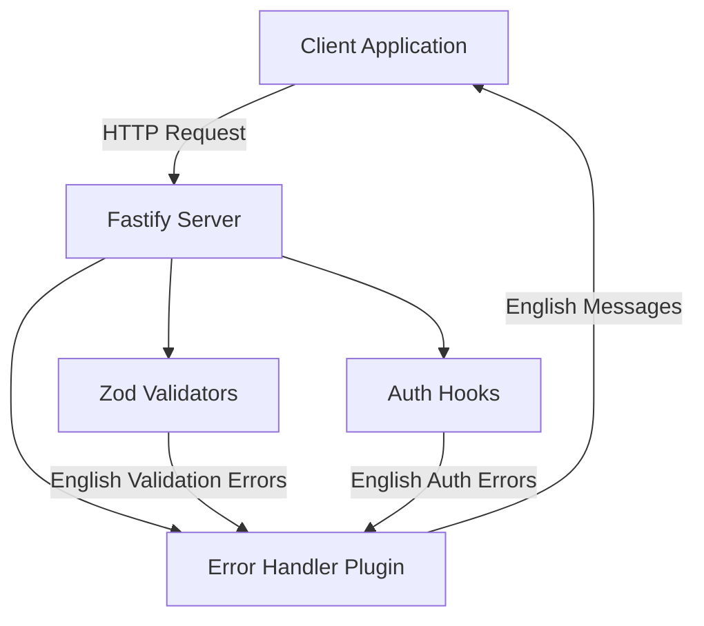
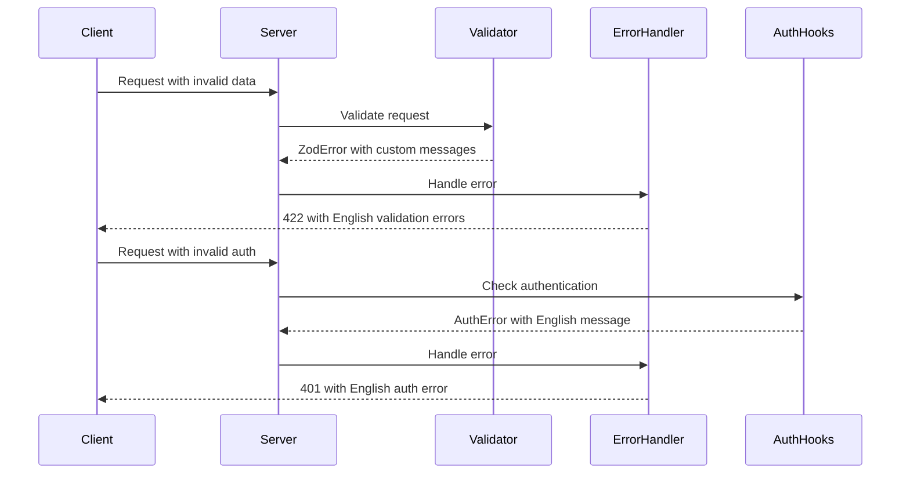

# System Design & Architecture

## Architecture Overview

**What is the high-level system structure?**

The changes primarily affect the message layer between server and client, without changing the core architecture:



**Key components and their responsibilities:**

- **Auth Hooks** (`server/src/hooks/auth.hooks.ts`): Authentication/authorization checks - needs message translation
- **Error Handler Plugin** (`server/src/plugins/errorHandler.plugins.ts`): Centralized error handling - needs message standardization
- **Zod Validators** (`server/src/schemaValidations/*.schema.ts`): Request/response validation - needs custom error messages
- **Client Validators** (`client/src/schemaValidations/*.schema.ts`): Client-side validation - needs consistency
- **Error Handler Utility** (`client/src/lib/utils.ts`): Client-side error handling - needs to properly handle all error types

**Technology stack choices and rationale:**

- Zod for validation (already in use) - supports custom error messages via `.message()` and `.refine()`
- Fastify error handler plugin (already in use) - centralized error response formatting
- React Hook Form (already in use) - integrates with Zod for client-side validation

## Data Models

**What data do we need to manage?**

No data model changes required. We're only updating message content in existing error/success response structures:

### Error Response Structure (Maintained)

```typescript
{
  message: string,        // English error message
  errors?: Array<{        // For validation errors (422)
    field: string,
    message: string
  }>,
  statusCode: number
}
```

### Success Response Structure (Maintained)

```typescript
{
  data: T,               // Response data
  message: string        // English success message
}
```

## API Design

**How do components communicate?**

### Error Flow



### Message Translation Points

1. **Auth Hooks** → Throw errors with English messages
2. **Zod Schemas** → Return validation errors with custom English messages
3. **Error Handler** → Format all errors with consistent English messages
4. **Services** → Throw errors with English messages (already mostly done)

## Component Breakdown

**What are the major building blocks?**

### Server-Side Components

#### 1. Auth Hooks (`server/src/hooks/auth.hooks.ts`)

**Current State:** Contains 3 Vietnamese messages
**Changes:**

- Translate `'Không nhận được access token'` → `'Access token not received'`
- Translate `'Access token không hợp lệ'` → `'Invalid access token'`
- Translate `'Bạn không có quyền truy cập'` → `'You do not have permission to access this resource'`

#### 2. Error Handler Plugin (`server/src/plugins/errorHandler.plugins.ts`)

**Current State:** Generic messages for some error types
**Changes:**

- Improve `EntityError` message: `'Error when authenticating...'` → `'Validation error occurred'`
- Ensure all error messages are clear and user-friendly
- Standardize message format across error types

#### 3. Validation Schemas (`server/src/schemaValidations/*.schema.ts`)

**Current State:** Use Zod default messages
**Changes:**

- Add custom `.message()` to all validation rules
- Ensure messages are user-friendly and descriptive
- Maintain consistency across similar fields (e.g., all email fields have same message format)

**Files to update:**

- `auth.schema.ts` - Login, refresh token schemas
- `account.schema.ts` - Account creation, update, password change
- `project.schema.ts` - Project CRUD operations
- `conversation.schema.ts` - Conversation operations
- `message.schema.ts` - Message operations
- `media.schema.ts` - File upload operations
- `llm.schema.ts` - LLM request schemas

### Client-Side Components

#### 1. Client Validation Schemas (`client/src/schemaValidations/*.schema.ts`)

**Current State:** Inconsistent message formats
**Changes:**

- Standardize error message format
- Ensure messages match server-side validation messages
- Add missing custom messages where Zod defaults are used

#### 2. Error Handler Utility (`client/src/lib/utils.ts`)

**Current State:** Handles `EntityError` for form field mapping
**Changes:**

- Verify it properly handles all error types from server
- Ensure error messages are displayed correctly
- May need enhancements to handle new error message formats

#### 3. Form Components

**Current State:** Use React Hook Form with Zod validation
**Changes:**

- Verify form error display works with updated validation schemas
- Test that server errors properly map to form fields

## Design Decisions

**Why did we choose this approach?**

### Decision 1: Translate in-place rather than create i18n system

**Rationale:**

- Requirement is specifically for English only
- No need for full i18n infrastructure
- Simpler implementation and maintenance
- Can add i18n later if needed without major refactoring

**Alternatives Considered:**

- Create i18n system with translation files - rejected as overkill for English-only requirement

### Decision 2: Add custom messages to Zod schemas rather than transform errors later

**Rationale:**

- Messages are defined where validation rules are defined
- Zod's `.message()` provides clean API for custom messages
- Easier to maintain and understand
- Type-safe with Zod

**Alternatives Considered:**

- Post-process Zod errors to add messages - rejected as more complex and harder to maintain

### Decision 3: Keep existing error response structure

**Rationale:**

- Client already handles current structure correctly
- No need to break backward compatibility
- Only message content needs changes

**Alternatives Considered:**

- Restructure error response format - rejected as unnecessary and breaking change

### Decision 4: Standardize messages to be user-friendly and action-oriented

**Rationale:**

- Better user experience
- Consistent tone across application
- Examples:
  - ❌ `'Invalid input'`
  - ✅ `'Email address is invalid'` or `'Password must be at least 6 characters'`

## Non-Functional Requirements

**How should the system perform?**

### Performance Targets

- No performance impact (text-only changes)
- Error handling latency remains unchanged (< 10ms overhead)

### Scalability Considerations

- Changes don't affect scalability
- Message translation is O(1) operation

### Security Requirements

- Error messages should not leak sensitive information (already handled)
- Validation error messages should not reveal system internals

### Reliability/Availability Needs

- No changes to error handling logic, only message content
- Should not introduce new failure modes
