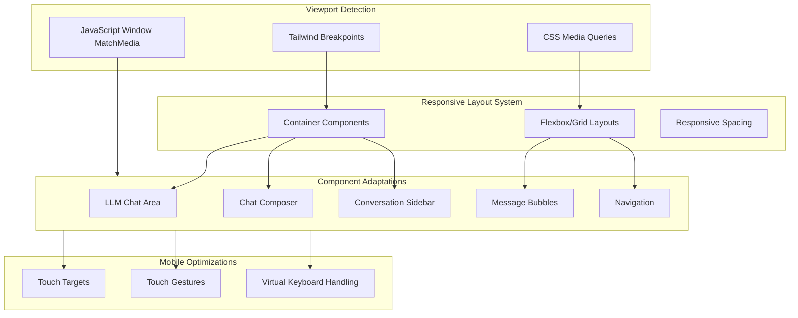

# System Design & Architecture

## Architecture Overview

**What is the high-level system structure?**



- **Responsive Strategy**: Mobile-first approach using Tailwind CSS utility classes and custom breakpoint utilities.
- **Component Architecture**: Each component will have responsive variants using Tailwind's responsive prefixes (`sm:`, `md:`, `lg:`, etc.).
- **Layout System**: Flexbox and CSS Grid with responsive column/gap adjustments.
- **Touch Optimization**: Separate touch-specific enhancements for mobile devices.
- **Rationale**: Leverage Tailwind's built-in responsive system for consistency and maintainability. Mobile-first ensures base styles work on smallest screens, then enhance for larger devices.

## Data Models

**What data do we need to manage?**

- **Viewport State** (client-side only):
  - `viewportWidth`: Current viewport width in pixels
  - `isMobile`: Boolean (width < 768px)
  - `isTablet`: Boolean (768px <= width < 1024px)
  - `isDesktop`: Boolean (width >= 1024px)
  - `orientation`: 'portrait' | 'landscape'
- **Responsive Configuration**:
  - Breakpoint definitions matching Tailwind defaults
  - Component-specific responsive rules (e.g., chat composer max-width, sidebar visibility)
- **No persistent data**: All responsive behavior is determined client-side via CSS and viewport detection. No database changes required.

## API Design

**How do components communicate?**

- **No new API endpoints required**: Responsive design is purely frontend/CSS-based.
- **Client-side utilities**:
  - `useViewport()` hook: React hook to detect viewport size and orientation
  - `useBreakpoint()` hook: React hook to check current breakpoint
  - Utility functions for responsive class generation
- **Component Props**:
  - Components may accept optional `mobileProps`, `tabletProps`, `desktopProps` for device-specific behavior
  - Most responsive behavior handled via CSS classes, not props

## Component Breakdown

**What are the major building blocks?**

### Frontend Components (Adaptations Needed)

1. **Layout Components**
   - `app/layout.tsx`: Main app layout - add responsive container classes
   - `components/app-provider.tsx`: May need viewport context provider

2. **LLM Chat Components**
   - `components/llm/llm-conversation-page.tsx`: Main chat page layout
     - Mobile: Full-width, hide sidebar or use drawer
     - Tablet: Sidebar as overlay/drawer, chat area full-width
     - Desktop: Sidebar + chat area side-by-side
   - `components/llm/llm-chat-area.tsx`: Chat message area
     - Responsive padding and margins
     - Adjust message bubble widths for mobile
   - `components/llm/chat-composer.tsx`: Input area
     - Mobile: Full-width, adjust padding
     - Max-width constraints for larger screens
   - `components/llm/message-bubble.tsx`: Individual messages
     - Responsive text sizes
     - Adjust bubble padding for mobile
   - `components/llm/conversation-item.tsx`: Conversation list items
     - Touch-friendly tap targets
     - Responsive text truncation

3. **Navigation & Sidebar**
   - `components/llm/conversation-sidebar.tsx` (if exists) or conversation list
     - Mobile: Hidden by default, accessible via drawer/menu
     - Tablet: Overlay/drawer pattern
     - Desktop: Persistent sidebar

4. **Form Components**
   - `components/forms/*`: All form inputs
     - Full-width on mobile
     - Appropriate max-widths on larger screens
     - Touch-friendly input heights

5. **UI Components**
   - `components/ui/*`: Button, input, card components
     - Minimum touch target sizes (44x44px)
     - Responsive padding and spacing

### Utilities & Hooks

- `hooks/useViewport.ts`: Custom hook for viewport detection
- `hooks/useBreakpoint.ts`: Custom hook for breakpoint checking
- `lib/responsive.ts`: Utility functions for responsive class generation

### No Backend Changes Required

- All responsive behavior is client-side CSS/JavaScript
- No API changes needed
- No database schema changes

## Design Decisions

**Why did we choose this approach?**

- **Mobile-First CSS**: Start with mobile styles as base, then enhance for larger screens. This ensures mobile experience is optimized and desktop gets enhancements rather than trying to scale down.
- **Tailwind CSS Breakpoints**: Use framework's built-in breakpoints for consistency. All developers familiar with Tailwind will understand the responsive classes immediately.
- **CSS-Only Where Possible**: Use CSS media queries and Tailwind responsive classes instead of JavaScript for most responsive behavior. This is more performant and works even if JavaScript fails.
- **Component-Level Responsive**: Each component handles its own responsive behavior rather than a global layout system. This keeps components self-contained and easier to maintain.
- **Touch Targets**: Enforce minimum 44x44px touch targets on mobile. This follows iOS Human Interface Guidelines and ensures usability.
- **Trade-offs**:
  - Using Tailwind classes everywhere means larger HTML, but better maintainability and consistency.
  - Mobile-first means desktop styles are additive, which can lead to more classes, but ensures mobile is never an afterthought.
  - No separate mobile templates means some components may have unused classes on certain devices, but keeps codebase simpler.
- **Patterns**:
  - Utility-first CSS (Tailwind approach)
  - Responsive design tokens (spacing, typography scales)
  - Progressive enhancement (base mobile, enhance for larger screens)

## Non-Functional Requirements

**How should the system perform?**

- **Performance**
  - CSS should be optimized - no unnecessary media queries
  - Responsive images should use `srcset` and `sizes` attributes
  - Lazy load below-the-fold content on mobile
  - Target: Lighthouse mobile performance score > 90
- **Scalability**
  - Responsive classes should be reusable across components
  - Breakpoint system should be consistent (use Tailwind defaults)
  - Easy to add new responsive components following established patterns
- **Security**
  - No security implications for responsive design (purely presentational)
- **Reliability**
  - Graceful degradation: If JavaScript fails, CSS-only responsive behavior should still work
  - Fallback styles for very old browsers (though we assume modern browsers)
- **Accessibility**
  - Maintain WCAG 2.1 AA compliance across all screen sizes
  - Ensure touch targets are accessible (minimum size, proper spacing)
  - Screen reader compatibility maintained on all devices
  - Keyboard navigation should work on all screen sizes

## Responsive Breakpoint Strategy

### Tailwind CSS Breakpoints (Standard)

- `sm`: 640px - Small tablets (portrait)
- `md`: 768px - Tablets (portrait), large phones (landscape)
- `lg`: 1024px - Small laptops, tablets (landscape)
- `xl`: 1280px - Desktops
- `2xl`: 1536px - Large desktops

### Component-Specific Breakpoints

**Chat Interface:**

- Mobile (< 768px): Full-width chat, sidebar as drawer
- Tablet (768px - 1023px): Sidebar overlay, chat area full-width
- Desktop (>= 1024px): Sidebar + chat side-by-side

**Chat Composer:**

- Mobile: Full-width, padding 12px
- Tablet+: Max-width 600px, centered, padding 16px

**Message Bubbles:**

- Mobile: Max-width 85% of container
- Tablet+: Max-width 70% of container

**Navigation:**

- Mobile: Hamburger menu or bottom navigation
- Tablet+: Top navigation bar or sidebar

## Touch & Interaction Design

- **Minimum Touch Targets**: 44x44px on mobile (iOS/Android guidelines)
- **Spacing**: Minimum 8px between interactive elements
- **Swipe Gestures**: Consider swipe-to-delete for conversation items (future enhancement)
- **Virtual Keyboard**: Ensure inputs remain visible when keyboard appears (viewport meta tag, scroll behavior)
- **Pull-to-Refresh**: Consider for conversation list (future enhancement)

## Animation & Transition Strategy

**How do we handle animations and transitions in responsive design?**

### Animation Principles

- **Performance First**: Use GPU-accelerated properties (`transform`, `opacity`) for smooth 60fps animations
- **Subtle & Purposeful**: Animations should enhance UX, not distract. Keep them subtle and meaningful
- **Respect User Preferences**: Honor `prefers-reduced-motion` media query for accessibility
- **Mobile-Optimized**: Shorter durations on mobile (200-300ms) vs desktop (300-400ms) for perceived responsiveness
- **Consistent Timing**: Use standardized timing functions and durations across components

### GPU-Accelerated Properties

**Always use these properties for animations:**

- `transform` (translate, scale, rotate)
- `opacity`
- `filter` (with caution, can be expensive)

**Avoid animating these properties:**

- `width`, `height`, `top`, `left`, `right`, `bottom` (causes layout reflow)
- `margin`, `padding` (causes layout reflow)
- `background-color` (causes repaint, use `opacity` with pseudo-elements if needed)

### Standard Animation Tokens

**Duration:**

- Fast: 150ms - Micro-interactions, hover states
- Normal: 200-300ms - Standard transitions, mobile interactions
- Slow: 300-400ms - Desktop transitions, complex animations

**Easing Functions:**

- `ease-out` (default): Most UI transitions, feels natural
- `ease-in-out`: For state changes that need to feel smooth both ways
- `cubic-bezier(0.4, 0, 0.2, 1)`: Material Design standard (Tailwind's `ease-in-out`)
- `cubic-bezier(0.16, 1, 0.3, 1)`: Smooth, elastic feel (for drawer/modal)

**Tailwind Classes:**

- `transition-all duration-200 ease-out` - Standard transition
- `transition-transform duration-300 ease-in-out` - Transform-only transition
- `transition-opacity duration-150 ease-out` - Opacity-only transition

### Component-Specific Animations

#### 1. Sidebar Drawer (Mobile/Tablet)

**Behavior:**

- Slide in from left/right using `transform: translateX()`
- Backdrop fade in/out using `opacity`
- Smooth open/close with spring-like easing

**Implementation:**

```css
/* Closed state */
transform: translateX(-100%);
opacity: 0;

/* Open state */
transform: translateX(0);
opacity: 1;

/* Transition */
transition:
  transform 300ms cubic-bezier(0.16, 1, 0.3, 1),
  opacity 200ms ease-out;
```

**Tailwind Classes:**

- `transform -translate-x-full md:translate-x-0` - Position
- `transition-transform duration-300 ease-[cubic-bezier(0.16,1,0.3,1)]` - Animation
- `opacity-0 md:opacity-100 transition-opacity duration-200` - Backdrop

#### 2. Layout Transitions (Responsive Breakpoints)

**Behavior:**

- Smooth transitions when layout changes at breakpoints
- Avoid jarring jumps when resizing window
- Use `will-change` hint for elements that will animate

**Implementation:**

- Use CSS transitions for property changes
- Debounce resize events to avoid excessive animations
- Consider `transform: scale()` for subtle size adjustments

**Tailwind Classes:**

- `transition-all duration-300 ease-out` - General layout transitions
- `will-change-transform` - Performance hint (use sparingly)

#### 3. Message Bubble Appearances

**Behavior:**

- Subtle fade-in and slide-up for new messages
- Stagger animation for multiple messages
- Smooth height transitions when textarea expands

**Implementation:**

```css
/* Message appearance */
@keyframes slideUpFade {
  from {
    opacity: 0;
    transform: translateY(10px);
  }
  to {
    opacity: 1;
    transform: translateY(0);
  }
}

.message-enter {
  animation: slideUpFade 200ms ease-out;
}
```

**Tailwind Classes:**

- Custom animation in `tailwind.config.ts`:
  ```js
  keyframes: {
    'slide-up-fade': {
      '0%': { opacity: '0', transform: 'translateY(10px)' },
      '100%': { opacity: '1', transform: 'translateY(0)' },
    },
  },
  animation: {
    'slide-up-fade': 'slideUpFade 200ms ease-out',
  }
  ```

#### 4. Chat Composer Expansion

**Behavior:**

- Smooth height transition when textarea grows
- No layout shift when composer expands upward
- Maintain scroll position during expansion

**Implementation:**

- Use `transform: translateY()` to move composer up as it grows
- Transition height smoothly (or use max-height trick for better performance)
- Ensure virtual keyboard doesn't cause jarring jumps

**Tailwind Classes:**

- `transition-[height,transform] duration-200 ease-out`
- `transform -translate-y-[var(--height-diff)]` - Dynamic transform

#### 5. Button & Interactive Element Hover/Active States

**Behavior:**

- Subtle scale or opacity change on hover (desktop)
- Immediate feedback on touch (mobile)
- Smooth transitions between states

**Implementation:**

```css
/* Desktop hover */
.button:hover {
  transform: scale(1.02);
  transition: transform 150ms ease-out;
}

/* Mobile active */
.button:active {
  transform: scale(0.98);
  opacity: 0.9;
  transition: transform 100ms ease-out;
}
```

**Tailwind Classes:**

- `hover:scale-105 active:scale-95 transition-transform duration-150`
- `hover:opacity-90 active:opacity-80 transition-opacity duration-150`

#### 6. Loading States & Skeleton Screens

**Behavior:**

- Smooth fade-in when content loads
- Subtle pulse animation for skeleton loaders
- Avoid layout shift during loading

**Implementation:**

- Use `opacity` transitions for content appearance
- Skeleton pulse using `opacity` animation (0.5 to 1)
- Reserve space to prevent layout shift

**Tailwind Classes:**

- `animate-pulse` - Built-in Tailwind pulse animation
- `opacity-0 animate-fade-in` - Content fade-in

### Responsive Animation Differences

**Mobile:**

- Shorter durations (200-250ms) for perceived speed
- Larger touch feedback (scale 0.95 on active)
- Reduced motion for scroll-based animations
- Avoid parallax or complex animations that impact performance

**Tablet:**

- Medium durations (250-300ms)
- Balance between mobile speed and desktop polish
- Support both touch and mouse interactions

**Desktop:**

- Longer durations (300-400ms) for polished feel
- Hover states with subtle animations
- More complex animations acceptable (better performance)

### Accessibility Considerations

**Reduced Motion:**

- Always respect `prefers-reduced-motion` media query
- Disable or simplify animations for users who prefer reduced motion
- Provide instant state changes as fallback

**Implementation:**

```css
@media (prefers-reduced-motion: reduce) {
  *,
  *::before,
  *::after {
    animation-duration: 0.01ms !important;
    animation-iteration-count: 1 !important;
    transition-duration: 0.01ms !important;
  }
}
```

**Tailwind Support:**

- Use `motion-reduce:` variant for reduced motion overrides
- Example: `motion-reduce:transition-none`

### Performance Optimization

**Best Practices:**

1. **Use `transform` and `opacity` only** - GPU-accelerated, no layout reflow
2. **Avoid animating layout properties** - `width`, `height`, `margin`, `padding`
3. **Use `will-change` sparingly** - Only for elements that will definitely animate
4. **Debounce resize events** - Prevent excessive animations during window resize
5. **Use `requestAnimationFrame`** - For JavaScript-based animations
6. **Test on low-end devices** - Ensure 60fps on mobile devices

**Monitoring:**

- Use Chrome DevTools Performance tab to identify animation bottlenecks
- Check for layout thrashing (repeated layout calculations)
- Monitor frame rate during animations (target: 60fps)

### Animation Patterns

**Pattern 1: Fade In**

```tsx
<div className="opacity-0 animate-fade-in duration-200">Content</div>
```

**Pattern 2: Slide In (Drawer)**

```tsx
<div className="transform -translate-x-full transition-transform duration-300 data-[open=true]:translate-x-0">
  Drawer content
</div>
```

**Pattern 3: Scale on Interaction**

```tsx
<button className="transition-transform duration-150 hover:scale-105 active:scale-95">
  Button
</button>
```

**Pattern 4: Stagger Animation (Multiple Items)**

```tsx
{
  items.map((item, index) => (
    <div
      key={item.id}
      className="opacity-0 animate-fade-in"
      style={{ animationDelay: `${index * 50}ms` }}
    >
      {item.content}
    </div>
  ))
}
```

### Custom Tailwind Configuration

**Add to `tailwind.config.ts`:**

```typescript
extend: {
  keyframes: {
    'fade-in': {
      '0%': { opacity: '0' },
      '100%': { opacity: '1' },
    },
    'slide-up-fade': {
      '0%': {
        opacity: '0',
        transform: 'translateY(10px)',
      },
      '100%': {
        opacity: '1',
        transform: 'translateY(0)',
      },
    },
    'slide-in-left': {
      '0%': { transform: 'translateX(-100%)' },
      '100%': { transform: 'translateX(0)' },
    },
  },
  animation: {
    'fade-in': 'fade-in 200ms ease-out',
    'slide-up-fade': 'slide-up-fade 200ms ease-out',
    'slide-in-left': 'slide-in-left 300ms cubic-bezier(0.16, 1, 0.3, 1)',
  },
  transitionDuration: {
    '200': '200ms',
    '300': '300ms',
    '400': '400ms',
  },
}
```
