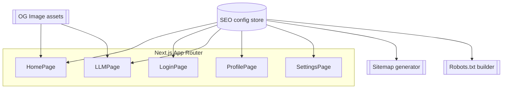

# System Design & Architecture

## Architecture Overview

**What is the high-level system structure?**

- Each route exports `metadata` or `generateMetadata` pulling from a typed SEO config module to keep copy centralized.
- A build-time sitemap generator walks the same config to include canonical URLs and `lastModified`.
- Shared OG image assets live under `public/og/` and are referenced inside the metadata config.
- Next.js 15 App Router natively handles automatic `<head>` rendering; no extra server needed.

## Data Models

**What data do we need to manage?**

- `SeoEntry`: `{ slug, route, title, description, locale, canonical, noindex, ogImage, schemaType, schemaPayload }`
- `OgAsset`: metadata describing OG/Twitter images (path, alt text, dimensions).
- Relationships: routes reference `SeoEntry` via `slug`; sitemap builder iterates entries filtered by `noindex`.
- Data flow: `seo.config.ts` exports typed objects → consumed by route metadata, sitemap generator, robots builder.

## API Design

**How do components communicate?**

- No external APIs required; SEO is static.
- Internal interfaces:
  - `getSeoEntry(route: string, locale?: string)` returning metadata for `generateMetadata`.
  - `buildSitemap(entries: SeoEntry[])` used in `app/sitemap.ts`.
  - `buildRobots(entries: SeoEntry[])` used in `app/robots.ts`.
- Authentication: n/a (public pages). Profile/settings remain protected but may still export metadata with `noindex`.

## Component Breakdown

**What are the major building blocks?**

- Frontend
  - `seo.config.ts`: central typed registry of SEO entries.
  - `SeoTagsPreview` (Storybook/dev helper) to verify metadata rendering.
  - OG image assets under `public/og/*`.
- Backend/build time
  - `app/sitemap.ts` generating XML from config.
  - `app/robots.ts` referencing sitemap, blocking internal routes.
- Third-party
  - Optional integration with Vercel OG image generation if dynamic images desired (future).

## Design Decisions

**Why did we choose this approach?**

- Central config ensures SEO copy is versioned and reviewed with code.
- Statically generated metadata keeps Lighthouse scores high and avoids runtime cost.
- Trade-offs:
  - Requires discipline to update config when adding pages.
  - Static OG images mean extra design work but avoid dynamic rendering complexity.
- Alternatives considered:
  - CMS-driven metadata (overkill).
  - Runtime metadata builder from API (adds latency/complexity).
- Principles: DRY metadata, typed contracts, automation for sitemap/robots.

## Non-Functional Requirements

**How should the system perform?**

- Performance: metadata should render server-side with zero additional client JS. Lighthouse SEO ≥ 90.
- Scalability: adding new pages only requires appending config; sitemap generation handles dozens of routes.
- Security: ensure no sensitive info leaks in metadata. Protected pages may set `noindex`.
- Reliability: build must fail if required metadata fields missing (TypeScript types + optional lint).
