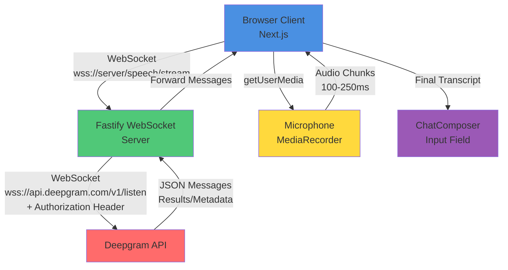

# System Design: Realtime Speech-to-Text với Deepgram

## Architecture Overview

**High-level System Structure:**



**Key Components:**

1. **Browser Client (Next.js)**
   - MediaRecorder API để capture audio từ microphone
   - WebSocket client để gửi audio chunks và nhận transcripts
   - UI components: microphone button, transcript preview, language selector

2. **Fastify WebSocket Server**
   - WebSocket endpoint `/speech/stream`
   - Proxy pattern: nhận từ client → forward sang Deepgram
   - Handle authentication (API key chỉ ở server)
   - Error handling và reconnection logic

3. **Deepgram WebSocket API**
   - Streaming transcription service
   - Returns JSON messages với transcript, is_final, speech_final flags
   - Supports interim_results, endpointing, language detection

**Technology Stack:**

- **Frontend:** Next.js, React, WebSocket API (native)
- **Backend:** Fastify, @fastify/websocket
- **External API:** Deepgram WebSocket API
- **Audio Processing:** MediaRecorder API (browser native)

## Data Models

**Core Entities:**

**WebSocket Messages (Client → Server):**

```typescript
// Audio chunk (binary)
type AudioChunk = ArrayBuffer | Blob

// Control messages (JSON)
type ControlMessage =
  | { type: 'Start'; language?: string; model?: string }
  | { type: 'Finalize' }
  | { type: 'CloseStream' }
  | { type: 'KeepAlive' }
```

**WebSocket Messages (Server → Client):**

```typescript
// Deepgram Results (forwarded)
type DeepgramResult = {
  type: 'Results'
  channel_index: number
  duration: number
  start: number
  is_final: boolean
  speech_final: boolean
  channel: {
    alternatives: Array<{
      transcript: string
      confidence: number
      words: Array<{
        word: string
        start: number
        end: number
        confidence: number
      }>
    }>
  }
}

// Metadata
type DeepgramMetadata = {
  type: 'Metadata'
  transaction_key: string
  request_id: string
}

// UtteranceEnd
type UtteranceEnd = {
  type: 'UtteranceEnd'
  last_word_end: number
}

// SpeechStarted
type SpeechStarted = {
  type: 'SpeechStarted'
}

// Error
type ErrorMessage = {
  type: 'error'
  message: string
}
```

**State Management (Client):**

```typescript
type SpeechToTextState = {
  isRecording: boolean
  isConnecting: boolean
  transcript: string
  interimTranscript: string
  language: 'vi-VN' | 'en-US' | 'ru-RU'
  error: string | null
  websocket: WebSocket | null
  mediaRecorder: MediaRecorder | null
}
```

**Data Flow:**

1. **Audio Capture Flow:**

   ```
   Microphone → MediaRecorder → Audio Chunks (100-250ms) → WebSocket (binary) → Fastify → Deepgram
   ```

2. **Transcript Flow:**

   ```
   Deepgram → JSON Messages → Fastify → WebSocket (JSON) → Browser → UI Update
   ```

3. **Control Flow:**
   ```
   Browser → Control Message (JSON) → Fastify → Deepgram
   ```

## API Design

**WebSocket Endpoint:**

**Endpoint:** `wss://{server}/speech/stream`

**Connection Handshake:**

- Client connects với authentication (JWT token trong query hoặc header)
- Server validates authentication
- Server opens connection to Deepgram với API key

**Query Parameters (Deepgram Connection):**

```
wss://api.deepgram.com/v1/listen?
  model=nova-2
  &language=vi-VN
  &interim_results=true
  &endpointing=300
  &punctuate=true
  &smart_format=true
  &utterance_end_ms=1000
```

**Message Protocol:**

1. **Client → Server:**
   - Binary: Audio chunks (ArrayBuffer/Blob)
   - JSON: Control messages (`{type: 'Start', language: 'vi-VN'}`)

2. **Server → Client:**
   - JSON: Deepgram messages (Results, Metadata, UtteranceEnd, SpeechStarted)
   - JSON: Error messages

**Authentication:**

- WebSocket connection requires JWT authentication
- API key chỉ có ở server (environment variable)
- Client không bao giờ thấy API key

**Error Handling:**

- Network errors → Auto-reconnect với exponential backoff
- Deepgram errors → Forward error message to client
- Authentication errors → Close connection với error code
- Microphone errors → Show user-friendly error message

## Component Breakdown

**Frontend Components:**

1. **`useSpeechToText` Hook**
   - Manages WebSocket connection
   - Handles MediaRecorder lifecycle
   - Processes Deepgram messages
   - Returns state: `{isRecording, transcript, error, start, stop}`

2. **`MicrophoneButton` Component**
   - Toggle button để start/stop recording
   - Visual feedback (pulse animation khi recording)
   - Disabled state khi không có permission

3. **`TranscriptPreview` Component** (optional)
   - Hiển thị interim transcript
   - Highlight final vs interim text
   - Auto-scroll khi transcript updates

4. **`LanguageSelector` Component**
   - Dropdown để chọn ngôn ngữ
   - Options: Vietnamese, English, Russian
   - Persist selection (localStorage)

5. **`ChatComposer` Integration**
   - Thêm microphone button vào composer
   - Hiển thị transcript trong input field hoặc preview
   - Auto-fill input với final transcript

**Backend Components:**

1. **`speech.route.ts`**
   - WebSocket route registration
   - Authentication middleware
   - Connection handling

2. **`speech.controller.ts`**
   - WebSocket connection handler
   - Deepgram WebSocket client management
   - Message proxying logic
   - Error handling

3. **`speech.service.ts`** (optional, nếu cần business logic)
   - Deepgram connection factory
   - Message transformation (nếu cần)
   - Rate limiting (nếu cần)

**Configuration:**

```typescript
// server/src/config.ts
DEEPGRAM_API_KEY: string
DEEPGRAM_MODEL: string (default: 'nova-2')
DEEPGRAM_ENDPOINTING: number (default: 300)
```

## Design Decisions

**Key Architectural Decisions:**

1. **Backend Proxy Pattern**
   - **Why:** Bảo mật API key, không lộ ra client
   - **Trade-off:** Thêm server load, nhưng cần thiết cho security
   - **Alternative considered:** Client direct connection (rejected vì security risk)

2. **WebSocket thay vì REST API**
   - **Why:** Realtime streaming, low latency
   - **Trade-off:** Phức tạp hơn REST, nhưng cần thiết cho realtime
   - **Alternative considered:** REST với polling (rejected vì latency cao)

3. **Binary Audio Chunks (100-250ms)**
   - **Why:** Deepgram khuyến nghị, giảm latency
   - **Trade-off:** Network overhead, nhưng cần thiết cho realtime
   - **Alternative considered:** Larger chunks (rejected vì latency cao)

4. **Interim Results**
   - **Why:** Better UX, user thấy transcript ngay
   - **Trade-off:** More messages, nhưng UX tốt hơn
   - **Alternative considered:** Chỉ final results (rejected vì UX kém)

5. **Endpointing (300ms)**
   - **Why:** Tự động chốt câu khi user pause
   - **Trade-off:** Có thể chốt sớm, nhưng UX tốt hơn
   - **Alternative considered:** Manual stop only (rejected vì UX kém)

**Patterns Applied:**

- **Proxy Pattern:** Backend proxy WebSocket connections
- **Observer Pattern:** WebSocket event handling
- **State Machine:** Recording states (idle → connecting → recording → finalizing)

## Non-Functional Requirements

**Performance Targets:**

- **Latency:** < 500ms từ audio chunk đến interim result
- **Throughput:** Handle continuous audio streaming không drop
- **Memory:** Không leak khi streaming lâu (> 10 phút)
- **CPU:** MediaRecorder không block main thread

**Scalability Considerations:**

- WebSocket connections: Support ít nhất 100 concurrent connections
- Deepgram rate limits: Monitor và handle gracefully
- Server resources: WebSocket connections lightweight, nhưng cần monitor

**Security Requirements:**

- ✅ API key không bao giờ lộ ra client
- ✅ WebSocket connections require authentication
- ✅ Input validation cho tất cả messages
- ✅ Rate limiting để prevent abuse (nếu cần)

**Reliability/Availability:**

- Auto-reconnect khi WebSocket drops
- Graceful degradation khi Deepgram unavailable
- Error messages user-friendly
- Logging cho debugging

**Accessibility:**

- Microphone button có aria-label
- Keyboard navigation support
- Screen reader announcements cho transcript updates
